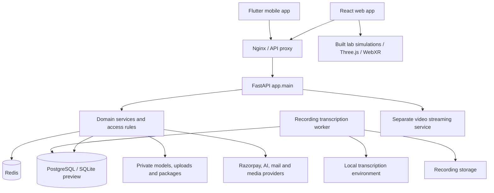
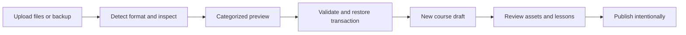
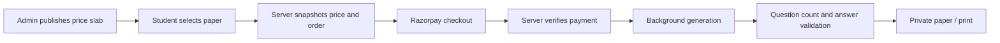

# SashaInfinity learning platform

Architecture, operating processes and codebase guide

Snapshot: 6 September 2026. Scope: the outer `Sasha_LMS` workspace delivered with the GPT handover. This document describes the code inspected locally and distinguishes implemented behavior from integrations that require configuration or hardware validation. It is not a production deployment certificate.

## 1. System map

SashaInfinity combines course delivery, practical investigations, assessment, learner support, commerce and institutional workflows. React renders the web application; FastAPI owns authentication, authorization, records and business rules. PostgreSQL is the intended deployment database. The current Windows preview uses SQLite. Files live in several purpose-specific directories or external media stores; a database backup alone is insufficient to recover all content.

The static inventory contains **176 frontend route patterns, 149 lazy page modules, 84 router registrations, 136 declared SQLAlchemy table names and 1,114 source files**. These are source counts, not a claim that every experimental module runs in production. Router registrations include conditional mounts. The inventory excludes vendored libraries, secrets, databases, generated public lab copies and the nested duplicate checkout.

The full lists are in `docs/CODEBASE_INDEX.md` and `docs/ARCHITECTURE_INVENTORY.json`. Regenerate them with `python scripts/build_architecture_inventory.py` after route or schema changes.

## 2. Code ownership and entry points

| Area | Source of truth | Responsibility |
|---|---|---|
| Web bootstrap | `frontend/src/main.tsx` | Mount React, providers and global design styles |
| Routes and layouts | `frontend/src/App.tsx` | URL-to-page mapping, role guards and layout composition |
| Route guidance | `frontend/src/components/routing/` | Lazy page loading, Back navigation, page purpose and workflow banners |
| Shared design | `frontend/src/components/design-system/`, `frontend/src/styles/astra-*.css` | Brand tokens, surfaces, headings, route color families |
| Web data access | `frontend/src/api/` | Axios contracts and domain clients |
| Web state | `frontend/src/store/`, `frontend/src/hooks/` | Authentication, course state and reusable application behavior |
| API entry | `backend/app/main.py` | Lifespan, middleware, router registration and service integration |
| Request layer | `backend/app/routers/`, `backend/app/schemas/` | HTTP contracts, role checks and payload validation |
| Business layer | `backend/app/services/` | Payments, imports, grading, lab models, planning and operations |
| Persistence | `backend/app/models/`, `backend/app/core/database.py` | SQLAlchemy schema, sessions, table creation and legacy schema repair |
| Migrations | `backend/alembic/versions/` | Versioned migrations; latest inspected revision is 0028 |
| Background work | `backend/app/workers/recording_lessons.py` | Separate transcription job loop and heartbeat |
| Labs | `frontend/labs/`, `frontend/scripts/build-labs.mjs` | Editable simulation sources and deterministic published assets |
| Mobile | `flutter_app/lib/` | Flutter features, routes, repositories and presentation |
| Video service | `streaming-service/video_streaming.py` | Separate yt-dlp streaming path |
| Edge and operations | `nginx/`, Compose files, `scripts/` | Proxying, containers, backups and administrative tooling |

Edit the outer tree. `main_simple.py`, `main_test.py`, `.bak` files and root transcript dumps are not substitutes for `backend/app/main.py`. Do not edit `frontend/public/labs/cbse` by hand; the build overwrites it from `frontend/labs`. Flutter has its own UI implementation; web style changes do not automatically redesign the mobile app.

## 3. Roles and feature segments

| Audience | Workspaces | Main boundaries |
|---|---|---|
| Visitor | Courses, learning labs, public information, account access | Published/public-preview content only; notebooks require login |
| Student | Learning, Progress, Explore, Career & Community | Own enrollments, submissions, notebooks and purchased papers |
| Instructor | Teaching, Content Studio, Assessment & Support, Learners & Insights | Own or explicitly editable courses, authoring and learner support |
| Admin | Learning & Content, People & Access, Commerce, Internships, Insights & Community | Publication, pricing, shared libraries and operational administration |
| Superadmin | Supervisory dashboards and account/audit tools | Elevated administration as explicitly checked by each API |
| Company / manager | Company dashboard, internships, attendance and reviews | Organization-scoped records |
| SPOC | Cohorts, students, institution and internship tools | Assigned institutional scope |
| Parent | Parent dashboard and linked learner information | Explicit parent-learner relationships |

Frontend menus make features discoverable. They do not authorize access. Each protected API must check the user, role and object ownership or enrollment. Role spelling and normalization are centralized for web landing routes in `utils/role-routing.ts`; backend endpoint dependencies remain authoritative.

## 4. Page design and navigation

Every lazy-routed page passes through the shared route wrapper. `PageGuide` renders only where returning is useful: course/lab details, lessons, editing/creation flows, live-class joining and account/checkout steps. Home, catalogs, dashboards and main navigation destinations keep their existing headings without an extra Back banner. Contextual Lab Studio links from a chapter/template also receive Back. The guide contains a purpose statement and an expandable three-step workflow. `page-guides.ts` controls placement and destination-specific wording.

Back first uses React Router's existing history index, preserving the previous URL including its query parameters and hash. When the page was opened directly, it uses a same-origin referrer or a role-appropriate parent destination. External referrers are never used as an application fallback. It does not promise to restore unsaved form edits. Authoring pages save explicitly.

Pages with their own return controls do not receive a duplicate banner. The lab workspace and quiz/assignment builders reuse `PageBackButton` in their existing headers; course editors and lesson players retain their existing course-return controls.

Anonymous 401 responses stay with the requesting screen so it can explain sign-in requirements. Previously, unconditional global redirection could send a visitor through a login loop when they pressed Back. Authenticated token refresh remains in the Axios interceptor.

Shared styling uses the existing orange, navy and translucent-surface brand, local fonts and responsive spacing. Page introductions use lightweight surfaces; they do not add a background blur to every list item. New GLB authoring controls use the same surface and button treatment. Banners are hidden during printing. The Courses catalog has prominent All courses, Meiporul, Seyappaduporul and Utporul filters alongside search/sorting, with the selection stored in the URL and sent as `course_type` to the API.

Performance measures include on-demand page modules, on-demand Three.js viewer loading, reduced blur on repeated cards, bounded GLB uploads and viewer geometry/material/texture disposal. The model viewer observes its container size so sidebar and responsive layout changes resize the canvas. These measures reduce avoidable work; latency still depends on model complexity, hardware, network and server load.

## 5. Course creation, custom links and publication

1. Open course creation from the role's content workspace. Enter the title, course type and custom course link.
2. The link field checks availability after a 350 ms debounce. The API normalizes the slug, rejects invalid/reserved/numeric links and checks existing courses, including drafts.
3. Saving enforces uniqueness again through a case-insensitive database index. A browser availability message is advisory; the database handles competing saves.
4. Build sections and lessons using the course's enabled tools. Attach videos, documents, interactive activities or virtual labs through their existing libraries.
5. Preview and review the course, then use the appropriate publication controls. Editing a course title preserves its existing URL. Numeric course IDs remain usable.

Important files: `components/course/CourseLinkField.tsx`, `pages/instructor/course-start.tsx`, `pages/instructor/edit-course.tsx`, `pages/admin/new-course.tsx`, `routers/courses.py`, `services/course_service.py`, `core/course_links.py`, `models/course.py` and migration `0028`.

## 6. Course uploads and backups

`course_packages.py` delegates staging, validation and restoration to `course_package_service.py` and `course_asset_service.py`. Detection inspects content and manifests rather than trusting the filename alone. A restore creates a new draft with remapped IDs; it does not overwrite an existing course or import learner history.

| Input | Result |
|---|---|
| PDF / DOCX / TXT / Markdown | Document or text lesson; original resources retained where supported |
| PNG / JPEG / WebP / GIF | Image content with original resource |
| MP4 / WebM | Video lesson using the media path |
| MP3 / WAV | Audio media content |
| GLB | Private model entry for a standalone 3D lesson |
| Sasha course backup | Course, sections, lessons, assessments and supported interactive dependencies |
| H5P or lab-specific package | Import through the relevant library or include it in a course backup |

Course backups use format `sasha-course-backup`, version 1, with `manifest.json`, `course.json` and described assets. Limits in the inspected code are 200 MB upload, 500 MB expanded assets and 20 MB manifest/course data. Paths, sizes, checksums and supported dependency types are checked before restore. Staged previews expire and cleanup is handled by operations logic.

Interactive dependencies include games, GeoGebra, GLB models, H5P and custom virtual labs. A GLB attached to a concept lab is now collected with the course backup and restored before the lab so its model ID can be remapped. Standalone 3D lesson type rules still apply; attaching a model inside a virtual lab does not change the enclosing course's type.

This is a content backup, not a whole-system disaster-recovery backup. It excludes accounts, payment history and learner progress. External media links may still depend on the original provider; review export warnings.

## 7. Virtual labs: source, authoring and model upload

The supplied `.zcode/workspace/default/cbse-virtual-labs.zip` and earlier `cbse-virtual-labs (1).zip` were inspected. Its SHA-256 is `b6fa2e44843442dafa7d5b3f7432bb221f2c44ad97377dbd5a428dfe36149c65`, matching the bundle already imported. It contains 71 archive entries and 59 simulations. The duplicate was not unpacked over the corrected source tree.

Editable simulations live under `frontend/labs/simulations/<subject>/<lab>/`, with separate HTML, JavaScript and CSS. Shared runtime, spatial bridges, vendor files and catalogs have dedicated directories. `npm run labs:build` publishes generated assets and backend seed data; `npm run labs:check` verifies that generated output matches source.

The active library contains the 59 supplied simulations. Generated built-in activities and PhET simulations are retired from learner catalogs and course pickers. New guided activities select a supplied simulation; older engine implementations remain only for stored-draft compatibility. The curriculum catalog has 463 stable chapter IDs across two editions: 233 legacy entries and 230 newer entries. A chapter link identifies a learning activity, not independent certification of complete curriculum coverage.

Authoring process:

1. Choose a supplied simulation and optional chapter, and write the objective, prediction and investigation steps.
2. In **Add a 3D model to this investigation**, upload a GLB or select an owned/shared-library model. Uploads are limited to 50 MB and must be self-contained glTF 2.0 containers with embedded textures/buffers.
3. Inspect the inline model preview. Models can be rotated, zoomed and reset. Remove the attachment to choose another model.
4. Preview the experiment and optionally open its 3D model. The model supplements the selected simulation; importing a mesh does not automatically create physics or grading rules.
5. Save a private draft. Publish deliberately to share the concept lab in the catalog. Unpublishing removes public lab access. A model still used by another public preview or published lab may remain accessible through that use.
6. Place normalized model labels, add guided questions, control targets and observations, and enable an assessment when appropriate. Learners explore and submit evidence; the server checks answer keys and the saved activity revision. Free-text observations remain evidence for instructor review, without automatic marks. Private notebooks remain separate from scored attempts.

The GLB upload path is `POST /api/v1/three-d/models`; attachment is stored as optional `config.model_id` in the existing lab JSON. No new table is needed. `lab_model_service.py` centralizes attachment authorization and portable package validation. Draft creation/update checks owned or shared models; admin references must also exist.

Model files are stored privately under `backend/three_d/<owner>/`. The file endpoint permits the owner/admin, appropriate library authors, accessible enrolled lessons, published 3D tasks, public previews or published concept labs. It rejects unrelated signed-in users. Deletion is blocked while a lesson, lab or 3D task references the model.

## 8. Lab export, restore and spatial modes

| Saved lab | Export | Restore behavior |
|---|---|---|
| Investigation without GLB | `.sasha-labs.json` | Validated version 1 data-only pack; up to 30 labs |
| Investigation with GLB | `.sasha-labs.zip` | Lab data plus the actual model; new private model and lab IDs |
| Whole course containing a lab | Course backup ZIP | Remaps both the lab slug and its GLB model ID |

A GLB lab ZIP contains exactly `manifest.json`, `lab.json` and `model.glb`. The manifest identifies `sasha-lab-model-pack`, version 1, and a SHA-256 checksum. JSON is limited to 1 MB; lab ZIP upload is limited to 52 MB with a 50 MB model. Import rejects unexpected/duplicate paths, unsupported versions, checksum mismatches and malformed models. It creates new drafts and cleans up newly created model files if the transaction fails. Plain JSON model references may only point to models the author can attach on the current installation; exported GLB labs use the portable ZIP to avoid cross-installation ID ambiguity.

The ZIP from the user is a source-code bundle, not a Lab Studio backup. Uploaded HTML/JavaScript is not executed by Lab Studio. Custom authored investigations use validated data with existing simulation engines.

Spatial capability differs by activity. The bundled simulation runtime supports WebXR scene or panel modes on compatible devices; controls report when a browser lacks XR. Uploaded GLBs now have screen controls, embedded animation playback, part separation, VR entry, AR surface placement, and controller selection for labels. Unsupported devices keep the screen and text controls. No physical AR/VR device was validated in this change. HTTPS/secure context, compatible hardware, permissions and an appropriate browser remain necessary for WebXR activities.

## 9. Assessment and JEE/NEET payment flow

Admins create question-count slabs for JEE and NEET, set INR prices and control which slabs are published. Students pay once per generated paper. Staff can generate without this student payment wall and can supply pasted text or PDF/TXT/Markdown source material. Staff source upload limits are 10 MB, 120 PDF pages and 80,000 extracted characters; scanned input needs OCR before useful text generation.

Payment verification uses the stored order, signature, amount, currency and captured status. Gateway IDs cannot be reused. Editing a slab does not rewrite an existing checkout. Refund and reconciliation services share the normal commerce records; a refund revokes delivery. Failed generation retries the same paper without charging again. Completed content is reused.

Generation runs in bounded batches, validates the requested count and rejects duplicates/invalid answer structures. It uses the API background-task process with a recovery lease and generation identifier, not a separate durable distributed job fleet. Staff outputs enter question banks as drafts; students' papers remain private.

Relevant files: `routers/exam_papers.py`, `services/exam_paper_service.py`, `models/exam_paper.py`, `schemas/exam_paper.py`, `pages/exam-papers.tsx` and `pages/admin/exam-pricing.tsx`.

The preview has no configured `GLM_API_KEY`, so live AI generation and checkout are disabled there. Payment and AI behavior were exercised with mocks. Production requires configured provider credentials, published slabs and gateway test-mode verification before live sales.

## 10. Live teaching, transcription and learner support

Live-class APIs cover scheduling, sessions, attendance, polls, recordings and internal finalization. Playback can use direct YouTube embedding, the separate yt-dlp path or Bunny CDN. Keep these paths distinct when changing media access. The standalone streaming service is not an authorization boundary; the backend must gate access first.

Enrolled students see **Live now** on their dashboard and course catalog, a badge on matching course cards, and a course-specific Join live entry on the course detail page. `StudentLiveProvider` shares one query to `GET /api/v1/live/live-now` across these surfaces. The backend returns only non-deleted classes with live status visible through active enrollment. The web query refreshes every 30 seconds while visible and on window focus; it does not poll separately for every card. Join links use the existing student join route and server authorization/token process. Ended classes disappear after refresh; the UI does not invent a live state from a scheduled time.

The selected transcription approach is self-hosted. A separate Python environment runs the local transcription model. A worker claims recording jobs from the application database, writes timestamped text and emits an operations heartbeat. Instructors search and correct segments, review notes/chapters and create a draft course lesson. Initial notes are extractive and must not be presented as a verified semantic summary. Recording-to-lesson creation does not auto-publish or award mastery.

The learner recording reader checks enrollment and publication and uses the existing signed recording-media path. Transcript access and playable media can differ when a recording has expired or signing is unavailable. See `docs/RECORDING_LESSONS.md` for installation and worker commands.

Assessment Studio, review queues, gradebooks, learning signals, mastery and the planner form the support loop: author/review an assessment; publish and collect learner work; grade with the domain rules; record evidence; surface weak areas or interventions; have staff review recommendations. Keep authored drafts, operational signals and awarded grades distinct.

## 11. Data, security and recovery boundaries

| Domain | Main records and relationships |
|---|---|
| Identity | Users, role profiles, authentication/session-related records |
| Learning content | Course -> sections/lessons; lessons -> media or interactive dependencies |
| Participation | User + course -> enrollment; user + lesson -> progress/watch activity |
| Assessments | Quiz/assignment/task -> questions/config; user -> attempt/submission -> grade/evidence |
| Labs | VirtualLabCatalog -> optional ThreeDModel; user + lab slug -> LabNotebook |
| Commerce | Price slab -> ExamPaper -> verified order/payment; enrollment/entitlement as appropriate |
| Recordings | LiveClass -> ClassReport / RecordingLesson -> draft/published lesson |
| Institutions | Company/cohort/internship relationships scope managers and SPOCs |
| Operations | CourseTransfer, job status, audit and heartbeat records |

See the generated table index for exact model files. JSON is used for configurable activities and some workflow metadata, so schema validation and reference remapping are essential; not every JSON reference has a relational foreign key.

Use JWT access/refresh credentials through the configured auth layer. Keep signing secrets stable in deployment; generated development secrets invalidate sessions after restart. Never expose `.env`, local launch settings, database files, backup staging or private model directories through the web server. Validate permission checks at the API even if menus hide an action.

For full recovery, back up the database and all required storage roots together: uploads, private 3D models, recording/transcription assets, certificates and relevant document/invoice stores. Include external-provider configuration in secure secret management. Rehearse restoration into an isolated environment and confirm file-to-record references. A course export alone is insufficient for system recovery.

## 12. Runtime and release process

The local Windows preview uses frontend `127.0.0.1:3002`, API `127.0.0.1:8012` and `backend/visual_qa.db`. The inspected base Docker configuration exposes Nginx on 3100, backend on loopback 8000, streaming on loopback 8001 and PostgreSQL on loopback 5432, with Redis on the internal network. Do not assume a second local checkout's ports or database belong to this workspace.

1. Select the target Compose configuration explicitly; the repo contains base, override and multiple production overlays.
2. Preserve a database/storage backup. Apply and inspect versioned migrations. Revision 0028 adds exam-paper/pricing records and a case-insensitive course-link unique index. Revision 0029 adds versioned investigation attempts and offline completion receipts; resolve duplicate links explicitly if migration reports them.
3. Install dependencies using the lockfiles. The frontend's documented installation uses `npm install --legacy-peer-deps` because of existing peer constraints.
4. Run frontend lint, type check, unit tests and production build. The build regenerates labs; run the generated-output check as well.
5. Run relevant backend tests with isolated test storage/database. Exercise import rejection, role isolation, refunds and callback recovery for changes in those domains.
6. Start the API, frontend/proxy and required workers. Check health, worker heartbeat, course delivery and media access through the actual edge route.
7. Validate payment/AI/transcription configuration in the target environment; run end-to-end checks before exposing sales or dependent features.

`init_db()` still calls `create_all()` and legacy schema-repair logic. Alembic also exists and must be used for versioned changes; the old AGENTS statement that there is no Alembic or backend test suite is outdated. Do not rely on startup repair as a substitute for migration review.

This change was applied to the local workspace and preview. It has not been pushed or deployed to production. Avoid running `build-production.sh` casually: it contains a host-wide Docker prune. The legacy deployment script also assumes a specific server path and remote.

## 13. Validation and remaining limits

Automated validation for this update covers lab-model ownership, malformed uploads, atomic backup rejection, model ID remapping, publication/unpublication, deletion protection, course backup compatibility, existing 3D tasks/public-preview behavior, navigation history and visitor 401 handling. Browser fixtures exercise GLB upload, model attachment, save, both preview surfaces and mobile overflow. A separate smoke pass checks 17 public screens at desktop/mobile widths.

The earlier release passed 95 backend tests and 396 frontend tests. The integrated release passed **67 selected backend tests and 399 frontend tests**, including new assessment, import and offline checks. Frontend lint, type check and production build passed. Course filter/live browser fixtures verify all three type selections, rejection of late responses from a previous filter, course-specific join links, phone layout and one shared live request across cards and the detail page. The live session, model and payment fixtures do not create a real class, upload user content or charge a payment.

Integrated evidence is in `astra-integrated-backend-full.log`, `astra-integrated-frontend-tests-final.log`, `astra-integrated-browser-final.log`, `astra-integrated-load-recovery.log` and `.toolchains/lab-qa/integrated-results/`. Earlier evidence files are `astra-lab-model-tests.log`, `astra-guide-frontend-tests.log`, `astra-guide-target-tests.log`, `astra-guide-build.log`, `astra-guide-lint.log`, `astra-guide-types-final.log`, `astra-guide-browser.log`, `astra-course-live-browser.log`, `astra-guide-public.log`, `.toolchains/lab-qa/page-guide-results/` and `.toolchains/lab-qa/course-live-results/`. Logs, not earlier summaries, are authoritative.

Known limits: physical AR/VR hardware is untested; live AI/payment providers are not activated in the local preview; course exports do not embed all external-provider media; no claim of zero latency or complete manual testing of all 176 route patterns is made. Every lazy page uses the common placement policy, while representative runtime routes were exercised in the browser. Live indicators reflect the last successful refresh and joining always rechecks access.

## 14. Maintenance map

| Change request | Start here | Check next |
|---|---|---|
| Add a page | `App.tsx` with `lazyPage` | Role menu, page guide rule, responsive layout and route contract |
| Change brand/UI | Design-system components and `astra-*.css` | Public, workspace, authentication and phone layouts |
| Add a lab engine | Concept schema, templates and `frontend/labs` runtime | Import validation, preview, notebook capture and generated assets |
| Add GLB behavior | `ThreeDViewer.tsx`, `lab_model_service.py` | Private file gate, resource disposal, portable backups |
| Change payments | Exam/order services and gateway integration | Signatures, idempotency, refunds, retries and audit records |
| Change course import | Package/asset services | Preview limits, traversal rejection, atomicity and ID remapping |
| Change data shape | SQLAlchemy model + schema + migration | Existing database upgrade and both SQLite/PostgreSQL behavior |
| Change recording workflow | Recording service, provider and worker | Ownership, media signing, job recovery and human review |

Related deep dives: `CLAUDE.md`, `BUILD.md`, `STREAMING_SETUP.md`, `VIDEO_PLAYER_IMPLEMENTATION.md`, `ADMIN_SETUP.md`, `docs/LABS_AND_REDESIGN.md`, `docs/COURSE_BACKUPS.md`, `docs/ASSESSMENT_STUDIO.md`, `docs/RECORDING_LESSONS.md`, `docs/FINAL_PHASE_IMPLEMENTATION.md` and `docs/ASTRA-DESIGN-REFERENCE.md`.

## 15. Integrated learning release

The product accent is now **#ff751f**. Shared route themes and lab frames use orange-led static gradients, the existing glass tiers, and darker orange for readable text and primary buttons. Learning preferences expose larger text, higher contrast, reduced motion, and English/Tamil labels for the new lab and offline flows. Missing Tamil text falls back to English; historical courses are not automatically translated.

### Supplied lab pack

Lab Studio includes a dedicated **Sasha Virtual Lab Pack** section. Administrators upload the supplied ZIP or an exported pack, inspect it, edit collection/lab names and visibility, and import all validated metadata atomically. Instructors and administrators may export the collection. Exports contain the original 59-lab assets plus `sasha-lab-pack.json`. Stable identifiers preserve course attachments. Executable assets must match the reviewed source ZIP; imports edit metadata without overwriting corrected runtime files. New executable lab implementations require source review and a rebuilt bundle; this is not an arbitrary HTML hosting endpoint.

### Evidence and assessment

`ConceptLabConfig` stores supplied simulation references, optional GLB models, normalized hotspots, bilingual explanations, ordered guided steps, concept tags and an assessment switch. Students submit UUID-tagged evidence to `/lab-studio/labs/{slug}/attempts`. `lab_investigation_service.py` owns answer checking, revision hashes, replay detection and mastery updates. Answer keys are omitted from learner responses. The same submitted UUID cannot be reused for different evidence. Quiz scoring reads the best result for the current activity revision, preventing an old result from silently grading a revised activity. Interaction reports are formative self-reported evidence, not remote proctoring.

### Offline learning

`frontend/offline.html` is a separate reader built with Vite. The service worker caches only bundled frontend assets, lab runtime files and this reader; it never caches API responses. Personal course text, validated lab configs, GLB blobs and queued work live in owner-scoped IndexedDB records. Downloads last seven days and are bounded to 150 MB per course and 250 MB per account. External video and linked attachments remain online. Signing out requests deletion of that account's local records.

Downloads require an active enrollment and a published course. Reconnecting sends queued evidence to existing server grading and completion rules. Completion checks enrollment, lesson publication and its content revision; revoked or stale work remains visibly unsynchronized. `OfflineSyncReceipt` deduplicates completion events. Installation and offline reload are production-build features; the normal Vite development server does not provide the generated worker.

### Operations and release evidence

Operations Center has a Launch readiness segment with database, storage, payment, webhook, AI, pricing and local-transcription signals. Configured is distinct from verified. Admins can run a small AI connectivity request or a read-only Razorpay authentication probe; neither proves a complete checkout/webhook flow. No new real payment or provider request was made during local tests.

`scripts/check_local_release.py` verified an isolated SQLite restore (139 matching table counts, integrity OK) and 60 local requests at concurrency eight: zero errors, p50 37.29 ms and p95 85.71 ms. These are local results. Course backup round trips are tested; production capacity and physical XR remain unverified.
